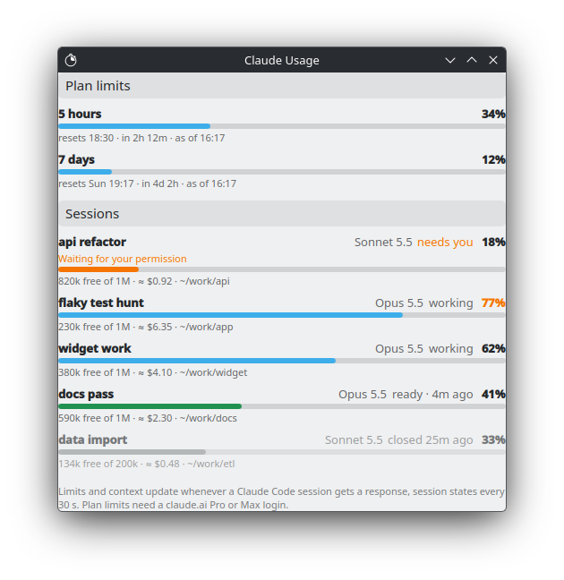

# Claude Usage

Your Claude Code plan limits (5-hour and weekly), every session's free context, and whether each
session is working, needs you or is ready for your next prompt, visible outside the session: in a terminal, to another Claude session that paces its work by them, in the KDE
Plasma panel, or in the Windows notification area.

It comes in two parts:

1. **The `claude-usage` command**, one standard-library Python script for Linux, macOS and
   Windows. Claude Code runs it as its status line command, and it keeps the figures in files.
   `claude-usage` prints them, and `claude-usage report --json` hands them to scripts and widgets.
2. **Widgets** that show those figures: a KDE Plasma 6 panel widget, and a Windows tray icon
   (not yet tested on Windows).

The widgets need part 1. Part 1 needs nothing else.

## How it gets the numbers

There is no documented way to read Claude plan usage from outside a Claude Code session: no
CLI command, nothing in `claude -p --output-format json`, and the transcript files are an
internal format. The one documented source is the JSON Claude Code pipes into its
**status line command** after each response
([docs](https://code.claude.com/docs/en/statusline)): `context_window.*`, and for claude.ai
Pro/Max logins `rate_limits.five_hour` / `seven_day` / `spend_limit`
(`used_percentage`, `resets_at`). The status line runs locally and spends no tokens.

```
Claude Code session ─┐  status line command, after every response
Claude Code session ─┼─> claude-usage statusline ──> ~/.local/state/claude-usage/sessions/<id>.json
Claude Code session ─┘  SessionEnd hook ─> claude-usage session-end  (marks the file ended)

terminal, Claude session, script ───────────> claude-usage report [--json]
                                              ├─ reads the session files
                                              └─ asks claude agents --json which sessions are open
Plasma widget ── every 30 s ──> claude-usage report --json ──> panel text + popup
Windows tray  ── every 30 s ──> claude_usage.py report --json ──> icon + menu
```

The plan limits are account-wide, and each session only reports them as of its own last
response. So the report takes the window with the latest `resets_at`, and within it the newest
reading. That reading is timed by the response it came from, not by when the status line last
ran, so a session whose status line re-runs without a new response can't roll the number back.
(The status line also re-runs when a prompt cache expires or a window resets.) Readings taken
within 5 minutes of the newest are compared by value and the highest wins, because parallel
sessions report in the order their responses end. Newest rather than highest matters after a
usage reset: usage drops to 0 but `resets_at` stays the same. So a newest reading 20 or more
points below the highest counts as a reset and wins at once. A smaller drop shows up once the
higher reading is 5 minutes old. Claude Code drops a window from
its JSON once `resets_at` passes; the last reading is kept so the report can say "reset at
12:00" rather than "no data".

Which sessions are still open, and what each is doing, comes from `claude agents --json`. The
[docs](https://code.claude.com/docs/en/agent-view) call it the supported way to read session
state from outside Claude Code. It lists every session whose process is alive, interactive and
background, with the same session id as the status line. Each one is *working*, *waiting* for
you (a permission prompt, a question) or *idle*, ready for your next prompt. The report runs it
each time, about 0.2 s, and it doesn't start Claude Code's background-session service. A
session file whose session isn't listed is *closed*, even when no `SessionEnd` came, as when a
terminal is closed. Background shells, monitors and subagents count as working: a session
whose turn has ended reads *working* until they finish.

## Part 1: the `claude-usage` command

Needs Python 3.10+, and Claude Code with a claude.ai Pro or Max login for the plan limits (an
API-key login still gets the context figures).

### Install on Linux or macOS

```bash
claude-usage/install.sh     # again = upgrade
claude-usage                # after the next response in any Claude Code session
```

It copies the script to `~/.local/bin/claude-usage` and adds two entries to
`~/.claude/settings.json`. Everything else in the file stays, and the file is backed up to
`settings.json.bak-<stamp>` whenever it changes:

```json
"statusLine": {"type": "command", "command": "/home/you/.local/bin/claude-usage statusline"},
"hooks": {"SessionEnd": [{"matcher": "", "hooks": [{"type": "command", "command": "/home/you/.local/bin/claude-usage session-end"}]}]}
```

It refuses to replace a `statusLine` you already have. `claude-usage/uninstall.sh` removes exactly
those entries and the command. The session files stay; the script prints where they are. The
python3 that ships with macOS is 3.9, so install a newer one first (python.org or Homebrew).

### Install on Windows

With Python 3.10+ from python.org, which brings the `py` launcher. Where there is no `py`,
`configure` uses `python`. In PowerShell, from the repo folder:

```powershell
New-Item -ItemType Directory -Force "$env:LOCALAPPDATA\claude-usage"
Copy-Item claude-usage\claude_usage.py "$env:LOCALAPPDATA\claude-usage\"
py "$env:LOCALAPPDATA\claude-usage\claude_usage.py" configure
py "$env:LOCALAPPDATA\claude-usage\claude_usage.py"            # the report
```

`configure` writes the same two entries, with the command as
`py "C:/Users/you/AppData/Local/claude-usage/claude_usage.py"`: forward slashes and a bare
launcher, so that it runs whether Claude Code goes through Git Bash or PowerShell. The session
files live in `%LOCALAPPDATA%\claude-usage\sessions`. `unconfigure` removes the entries again.
The Windows code paths are covered by the tests on Linux, but haven't run on Windows yet.

### Use

`claude-usage` (the same as `claude-usage report`):

```
5-hour   34%  resets 16:40 (in 2h 13m)  as of 14:27
7-day    12%  resets Mon 09:00 (in 4d 3h)  as of 14:27

example-app                  Opus       810k free of 1M (81%)      ready 2m ago   ~/work/example-app
api-server                   Sonnet     640k free of 1M (64%)      needs you (permission prompt)   ~/work/api-server
```

The state is `working`, `needs you (...)`, `ready 2m ago` or `closed 5m ago`. When `claude agents
--json` can't be run, it is `active` or `idle` by the time of the last response, as before, and
the report says why.

The status line itself prints nothing into Claude Code. With `statusline --print` in the
`statusLine.command`, Claude Code shows `ctx 812k free (81%) · 5h 34% → 16:40 · 7d 12%` there.

`claude-usage report --json` gives the same as JSON. It is what the widgets read, and anything
else may read it too:

| Field | |
|---|---|
| `version` | `1`, raised only for an incompatible change |
| `generated_at` | epoch seconds, like every time below |
| `limits.five_hour`, `.seven_day`, `.spend_limit` | `null` before the first reading, else: |
| &nbsp;&nbsp;`used_percentage` | 0–100 |
| &nbsp;&nbsp;`resets_at` | when the window resets, or `null` |
| &nbsp;&nbsp;`as_of` | when the response this reading came from ended |
| &nbsp;&nbsp;`expired` | `resets_at` has passed: usage since then is unknown until the next response |
| &nbsp;&nbsp;`session_id` | the session that reported it |
| `live` | `available`: whether `claude agents --json` answered; `error`: why not, or `null` |
| `sessions[]` | open sessions, sessions with a response in the last 24 hours, and ended ones for 6 hours after their end (or after their last response, when the end time is unknown). Those that need you come first, then active, idle, ended. Fields: `session_id`, `title`, `model`, `model_short`, `project_dir`, `cwd`, `cwd_display`, `context` (`size`, `used_percentage`, `remaining_percentage`, `free_tokens`, each `null` until measured), `cost_usd` (API-equivalent), `state` (`active`, `idle` after 30 min without a response, `ended`), `last_response_at`, `ended_at`, `end_reason`, `claude_version`, plus the fields below |
| &nbsp;&nbsp;`live` | `true` while Claude Code lists the session as open, `false` once it doesn't (then `state` is `ended`, with `ended_at` `null` unless `SessionEnd` ran), `null` without the list |
| &nbsp;&nbsp;`activity` | `working`, `needs_input` or `ready` while open, else `null` |
| &nbsp;&nbsp;`waiting_for` | with `needs_input`: what it waits for, as Claude Code says it (`permission prompt`, `input needed`, `sandbox request`, `worker request`, `dialog open`), `failed` for a failed background task, else `null` |
| &nbsp;&nbsp;`kind` | `interactive` or `background`, `null` when not listed |

The JSON is ASCII: other characters come `\u`-escaped.

### Let Claude sessions watch the limits

[`claude-usage/memory-template.md`](claude-usage/memory-template.md) tells a session to check
`claude-usage` at the start, at each milestone and before heavy steps, to say what a heavy step
will cost, and what to do near a limit (thresholds 80 % and 85 %, meant to be adjusted). Use it in
one of these ways:

- **Every session on the machine:** copy it to `~/.claude/plan-usage-limits.md` and add the line
  `@~/.claude/plan-usage-limits.md` to `~/.claude/CLAUDE.md` (or paste its text there).
- **One project:** save it as a memory. Copy it into that project's memory folder,
  `~/.claude/projects/<project path, / as ->/memory/`. Then add
  `- [Plan usage limits](plan-usage-limits.md) — check claude-usage at milestones` to the
  `MEMORY.md` beside it. Or paste it into a session and ask Claude to remember it.
- **A team's process document:** copy its list into it.

The front matter at the top is for the memory form. It does no harm in the others.

## Part 2: the KDE Plasma widget

- **Panel**: the 5-hour limit, the percentage large over the time left until it resets
  (`34%` over `2h 13m`). Amber from 70 %, red from 90 %. `—` over `reset` once the window has
  reset, `—` over `no data` before the first reading. An amber dot in the corner while a session
  needs you. The tooltip names them.
- **Popup**: the 5-hour and 7-day limits (and a spend limit, if you have one) with reset times,
  then every open Claude Code session and every other one from the last 24 hours: title, model,
  the share of its context in use (large, amber and red like the limits), what's free
  (`840k free of 1M`), API-equivalent cost, working directory. Sessions that need you come
  first. The color of a session's context bar says what it is doing:
  - blue: working;
  - amber: needs you, with the reason on a line of its own ("Waiting for your permission");
  - green: ready for your next prompt;
  - grey: closed.

  The row says the same in words. Drag the popup's edge to resize it; Plasma remembers the size,
  but never taller than what there is to show.
- **Settings** (right-click > *Configure Claude Usage*): show the session states or not, list
  closed sessions or not, and the panel dot. All on by default.



Needs KDE Plasma 6 and part 1.

```bash
claude-usage/install.sh                # part 1, if not done yet
plasmoid/install.sh                    # the widget; again = upgrade
plasmawindowed io.github.pe7ro.claudeusage   # try it in a window
```

Then right-click the panel > *Add or Manage Widgets* > **Claude Usage**. After an upgrade, a
widget that's already in the panel runs the old QML until `systemctl --user restart
plasma-plasmashell`. The widget runs `claude-usage report --json` every 30 s, from
`~/.local/bin` or anywhere on the PATH, and says so when it can't find it.
`plasmoid/uninstall.sh` removes the widget and nothing else.

## Windows tray icon (untested)

`windows/claude-usage-tray.ps1` shows the 5-hour percentage as a coloured square in the
notification area: blue, amber from 70 %, red from 90 %, `—` once the window has reset or before
the first reading, `!` on an error. The tooltip has both limits. A left or right click opens a
menu with the limits and every session; hovering a session shows its folder and cost. It runs in
Windows PowerShell 5.1, which comes with Windows 10 and 11, and needs nothing beyond part 1.

```powershell
# a quick check: prints what the icon, tooltip and menu would show
powershell -NoProfile -ExecutionPolicy Bypass -File windows\claude-usage-tray.ps1 -Print
```

To start it at login, put a shortcut in the Startup folder (Win+R, `shell:startup`) with the
target `powershell.exe -NoProfile -WindowStyle Hidden -ExecutionPolicy Bypass -File
"C:\path\to\claude-usage-tray.ps1"`. Windows 11 puts new tray icons in the overflow: drag it onto
the taskbar, or turn it on under Settings > Personalization > Taskbar > Other system tray icons.
Options: `-Script` (default `%LOCALAPPDATA%\claude-usage\claude_usage.py`), `-Python` (default
`py`, else `python`), `-PollSeconds` (30).

It has only run on Linux, in PowerShell 7 with `-Print`. That checks the parsing, the error
messages and every piece of text; the tray icon itself has not run on Windows yet. It doesn't
show the session states (working, needs you, ready) yet. A session closed without `SessionEnd`
shows as `ended`, without a time.

The same report could drive a macOS menu bar item (SwiftBar and xbar show a script's output) or
GNOME's Argos extension. Neither is built.

## Good to know

- **The figures update only when a Claude Code session gets a response.** With nothing running,
  the report shows the last reading and says when it was taken ("as of 10:07").
- **Usage outside Claude Code may not show up until later.** Chats in claude.ai web or the desktop
  app likely count against the same plan limit (not confirmed from the Claude Code docs). If so,
  the report only sees them at the next Claude Code response.
- **A usage reset shows up with the next Claude Code response after it**, like any other change
  to the limits. A drop of less than 20 points waits until the last higher reading is 5 minutes
  old, as described above.
- **A status line hides the footer's keyboard hints** (`esc to interrupt`, `? for shortcuts`).
  This happens even though this one prints nothing.
- "Free context" is the whole window. Auto-compact starts before it reaches 0.
- Observed on Claude Code 2.1.281, not documented: the status line also runs for background
  (daemon) sessions, and a changed `statusLine.command` makes every open session run it at once.
  Undocumented: whether `SessionEnd` fires on Ctrl+C or when the terminal is closed. It doesn't
  matter while `claude agents --json` works, since a session missing from it counts as closed
  (after a minute's grace: a new session may not be listed yet). Without it, a session that
  never reports its end turns *idle* after 30 min without a response and leaves the list after
  24 h.
- **The session states need `claude agents --json`.** The report runs `claude` from the PATH,
  or from `~/.local/bin`, where the native installer puts it. `CLAUDE_USAGE_CLAUDE` names
  another command. With agent view turned off (`disableAgentView`,
  `CLAUDE_CODE_DISABLE_AGENT_VIEW`), Claude Code refuses to list sessions. The widget then says
  "Session states unavailable" and falls back to active / idle.
- A finished background session reads *ready* until Claude Code's supervisor stops its process,
  about an hour after it was last attached, and *closed* after that.
- A session seen for the first time takes its last-activity time from the modification time of
  its transcript file (`transcript_path` in the status line JSON). Only the time is read, never
  the contents.
- Session files are `0600`, hold the full status line JSON (paths, model, cost), and are deleted
  8 days after their last update.

## Develop

```bash
python3 -m unittest discover -s tests   # the Python side, against temp dirs only
plasmoid/install.sh && plasmawindowed io.github.pe7ro.claudeusage
journalctl --user -b | grep -i claudeusage   # QML errors when it runs in the panel
pwsh -File windows/claude-usage-tray.ps1 -Print -Python python3 -Script claude-usage/claude_usage.py
```

```
claude-usage/claude_usage.py                  status line writer, hook, report, settings merge
claude-usage/install.sh, uninstall.sh         part 1 on Linux and macOS
claude-usage/memory-template.md               for Claude sessions: watch the limits
plasmoid/install.sh, uninstall.sh             part 2
plasmoid/package/metadata.json                KPackage metadata (Plasma/Applet)
plasmoid/package/contents/config/             settings: main.xml (entries), config.qml (pages)
plasmoid/package/contents/ui/main.qml         polling, tooltip, the two representations
plasmoid/package/contents/ui/CompactView.qml  panel text and dot
plasmoid/package/contents/ui/FullView.qml     popup; LimitRow.qml / SessionRow.qml are its rows
plasmoid/package/contents/ui/Bar.qml          the bars, drawn so their color can change
plasmoid/package/contents/ui/configGeneral.qml  the settings page
plasmoid/package/contents/ui/format.js        every piece of display text
windows/claude-usage-tray.ps1                 Windows tray icon; -Print for a text dump
tests/                                        unittest + status line fixtures
docs/                                         README images
```

Before publishing: a screenshot of the panel, and a name that doesn't read as an official
Anthropic product. (`docs/popup.png` shows made-up sessions.) More in
[`FUTURE_WORK.md`](FUTURE_WORK.md).

## License

MIT, see [LICENSE](LICENSE). Every source file carries its SPDX tags.
